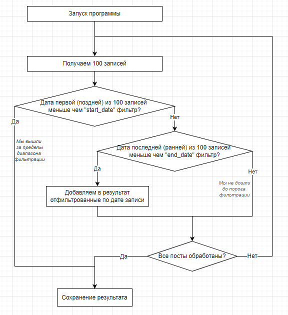

# Получение API ключа Вконтакте
Перед началом работы необходимо подготовить аккаунт Вконтакте для работы и создать токен доступа с необходимыми правами ([см. документацию](https://dev.vk.com/api/getting-started#%D0%90%D0%B2%D1%82%D0%BE%D1%80%D0%B8%D0%B7%D0%B0%D1%86%D0%B8%D1%8F%20%D0%BF%D0%BE%D0%BB%D1%8C%D0%B7%D0%BE%D0%B2%D0%B0%D1%82%D0%B5%D0%BB%D1%8F)). 

Более простой способ получения токена: 

 1. Перейти на https://vkhost.github.io/
 2. Выбрать приложение, которое будем эмулировать
 3. Подтвердить запрашиваемые права
 4. Скопировать токен из адресной строки

# Установка

В корневой папке создайте файл private.txt, куда поместите токен доступа Вконтакте
Запустите main.py, передав в качестве аргумента следующие параметры:
 

     python main.py <SOURCE_ID> --st=<START_DATE> --fr=<END_DATE> --out=<OUT_PATH>
    
 SOURCE_ID - идентификатор пользователя или сообщества
 START_DATE, END_DATE - начальная и конечная дата в формате YYYYMMDD
 OUT_PATH - файл для сохранения результата

Например:

     python main.py -112510789 -f=20220921 -t=20220921 --out=results.txt

> Данная команда запишет json-объекты публикаций сообщества MASH за 21 сентября 2022 года

## Алгоритм фильтрации по дате

